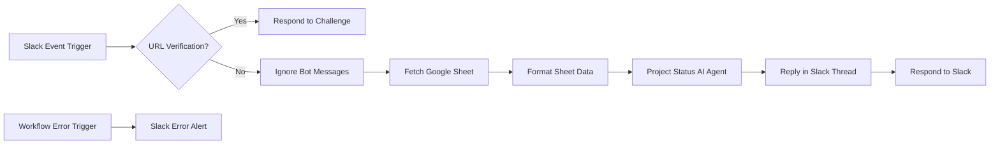
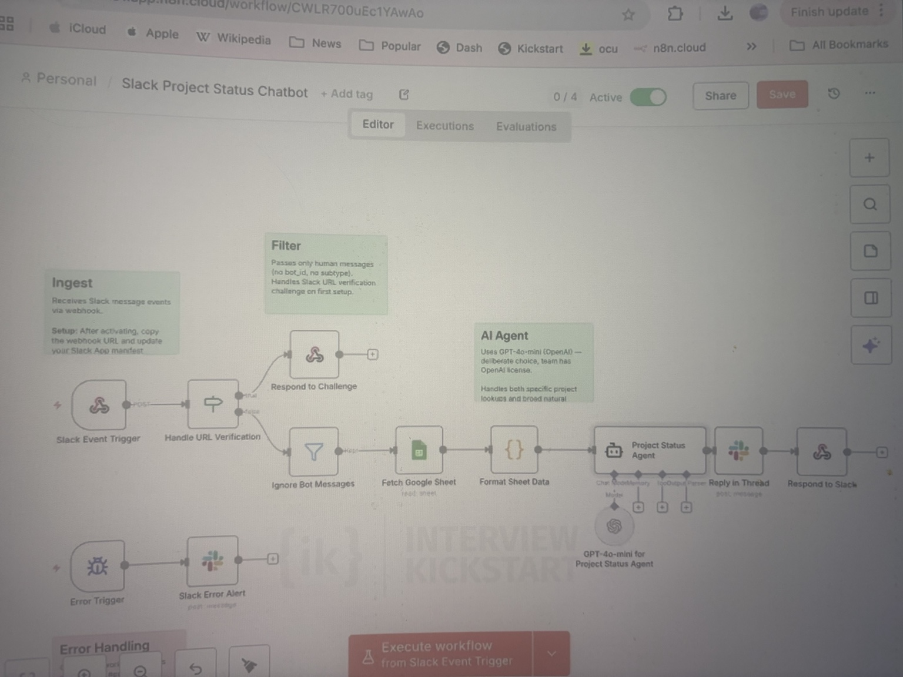

# slack_project_agent
# Slack Project Status AI Agent — n8n + Slack + Google Sheets + OpenAI

An AI-powered Slack workflow that answers project-status questions by reading a Google Sheet, formatting project data, using an OpenAI-powered agent to generate a concise response, and replying back in the original Slack thread.

This repo is packaged as a portfolio-ready automation project for AI Product Manager, Technical Product Manager, and AI/Automation roles.

---

## 1. Executive Summary

Teams often ask repeated questions like:

- “What is the status of Project Alpha?”
- “Which projects are blocked?”
- “Who owns the API migration?”
- “What is due this week?”

This workflow turns Slack into a natural-language project-status assistant. It listens to Slack events, filters out bot messages, retrieves the latest project tracker data from Google Sheets, uses an AI Agent to reason over the status data, and responds directly in Slack.

---

## 2. Business Problem

Project updates are often scattered across Slack, spreadsheets, standups, and status reports. This creates friction for product, engineering, and leadership teams because they have to manually search for ownership, blockers, dates, and status.

### Product goal

Reduce manual project-status follow-ups by enabling real-time, self-service project visibility from Slack.

---

## 3. Solution Overview

The workflow does the following:

1. Receives Slack event payloads via webhook.
2. Handles Slack URL verification challenge during setup.
3. Filters out bot-generated messages to prevent loops.
4. Reads project-status data from Google Sheets.
5. Formats sheet rows into structured context.
6. Sends the user query and project context to an OpenAI-powered AI Agent.
7. Responds in the same Slack thread.
8. Sends workflow failure alerts to a Slack error channel.

---

## 4. Architecture



### Screenshot



---

## 5. Tech Stack

| Layer                   | Tool             |
| ----------------------- | ---------------- |
| Workflow orchestration  | n8n              |
| Collaboration interface | Slack API        |
| Data source             | Google Sheets    |
| AI reasoning            | OpenAI GPT model |
| Error alerting          | Slack            |
| Optional local runtime  | Docker Compose   |

---

## 6. Key Features

- Slack event ingestion via webhook
- Slack URL verification handling
- Bot-message filtering to prevent infinite loops
- Google Sheets project tracker integration
- AI-generated project-status responses
- Threaded Slack replies
- Dedicated Slack error-alert workflow
- Portfolio-friendly documentation and setup guide

---

## 7. Product Thinking

### Target users

- Product managers
- Engineering managers
- Scrum masters
- Program managers
- Leadership teams needing quick status visibility

### Success metrics

| Metric                      | Why it matters                                            |
| --------------------------- | --------------------------------------------------------- |
| Query resolution rate       | Measures whether the bot answers without manual follow-up |
| Response latency            | Ensures the assistant feels real-time inside Slack        |
| Weekly active users         | Measures adoption across the team                         |
| Repeated question reduction | Measures operational efficiency gain                      |
| Escalation rate             | Tracks where the bot lacks confidence or data coverage    |

### Tradeoffs

| Decision                    | Tradeoff                                               |
| --------------------------- | ------------------------------------------------------ |
| Google Sheets as source     | Fast to prototype, but less scalable than a database   |
| LLM-generated response      | Natural and flexible, but requires guardrails          |
| Threaded Slack response     | Cleaner collaboration, but dependent on event metadata |
| Read-on-demand sheet lookup | Fresh data, but higher latency than caching            |

---

## 8. AI Guardrails

Recommended guardrails for production hardening:

- Ignore bot messages to prevent recursive loops.
- Only answer from the provided project-status context.
- Return “I don’t have enough data” when the sheet does not contain the answer.
- Keep responses concise and status-oriented.
- Log ambiguous questions for future prompt and data improvements.
- Add confidence scoring for low-confidence responses.

---

## 9. Repo Structure

```text
n8n-slack-project-status-agent/
├── README.md
├── workflows/
│   └── slack_project_status_chatbot_n8n.json
├── docs/
│   ├── setup-guide.md
│   ├── demo-script.md
│   ├── architecture-notes.md
│   └── workflow-screenshot.jpeg
├── data/
│   └── sample_project_status.csv
├── docker/
│   └── docker-compose.yml
├── scripts/
│   └── validate-workflow.sh
├── .env.example
├── .gitignore
└── LICENSE
```

---

## 10. Setup Instructions

Detailed setup is available in [`docs/setup-guide.md`](docs/setup-guide.md).

Quick start:

1. Import `workflows/slack_project_status_chatbot_n8n.json` into n8n.
2. Configure credentials for Slack, Google Sheets, and OpenAI.
3. Replace placeholder values:
   - Google Sheet ID
   - Sheet tab name
   - Slack channel IDs
   - Slack bot token credential
   - OpenAI credential
4. Activate the workflow.
5. Copy the production webhook URL into your Slack App event subscription settings.
6. Test from Slack using a project-status question.

---

## 11. Demo Script

A polished demo narrative is available in [`docs/demo-script.md`](docs/demo-script.md).

Suggested demo flow:

1. Show the project tracker in Google Sheets.
2. Ask a status question in Slack.
3. Show the n8n execution path.
4. Show the AI-generated response in the Slack thread.
5. Explain error handling and production hardening.

---

## 12. Portfolio Positioning

This project demonstrates:

- End-to-end workflow automation
- AI agent orchestration
- Slack and Google Sheets integration
- Prompt design and structured context assembly
- Product thinking around metrics, guardrails, and operational workflows
- Ability to prototype real enterprise AI workflows without heavy engineering dependency

---

## 13. Disclaimer

This is a portfolio/demo project. Remove all secrets, tokens, private channel IDs, customer data, and internal company information before publishing.